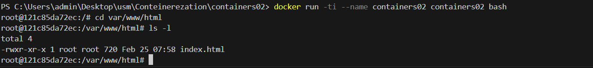

### Лабораторная работа №3
**Дисциплина:** Контейнеризация и Виртуализация
**Название:** Первый контейнер
**Имя Фаимиля:** Сергей Алексеев
**Дата:** 25.02.2025
***
#### Цель работы
 Данная лабораторная работа знакомит с основами контейнеризации и подготавливает рабочее место для выполнения следующих лабораторных работ.
***
#### Задание
Установить Docker Desktop и проверить его работоспособность.
***
#### Опсание выполянемой работы
1) Для начала создаем репозиторий *containers02* и клонируем его себе на компьютер.

2) Создаем в папке containers02 файл Dockerfile со следующим содержимым:

3) В этой же папке создае паку *site* с файлом *index.html* с произвольным содержимым.

4) **Запуск докер файла и его тестирование**
Запускаем создание образа

*Сколько времени создавался образ?*
    - Создание образа заняло -  **17.1 секунд.**

    **4.1)** Выполняем команду `docker run --name containers02 containers02`
    *Что было выведено в консоли?*  
    - Вывод при запуске контейнера
    
Сообщение `hello from` означает, что контейнер успешно запустился, данное сообщение мы установили с помощью `CMD ["sh", "-c", "echo hello from $HOSTNAME"] - устанвливает команду, которая будет выполнена при создании контейнера`, *$HOSTNAME* - идентификатор контейнера: `a41189a22eea`.
    **4.2)**  Удаляем созданный контейнер
    
    **4.3)** Выполняем следующие команды:
    
    *Что выводится на экране?*
     - Введя команду `ls -l` - мы получили список файлов в текущей директории, строка содержит *права доступа, владельца файла, дата создания и имя файла.*
    4.4) Закрвыем окно командой `exit`
    

***
#### Выводы

В ходе выполнения данной работы я научился создаввать простой докер-контейнер и запускать его у себя на компмьютере. Так же я научился удалять созданнный контейнер с помщью команды `docker rm containers02` и запускать контейнер с флагом  `-ti`  чтобы запустить контейнер в интерактивном режиме с подключённым терминалом. В данном терминале используя команду `ls -l` мы получили все файлы в диреткории `/var/www/html` и подробную информацию о них.
***
#### Используемые источники
- 
- https://how.dev/answers/what-is-the-cmd-command-in-docker
- https://translated.turbopages.org/proxy_u/en-ru.ru.49c4df0d-67be0983-196f849b-74722d776562/https/www.geeksforgeeks.org/file-system-navigation-commands-in-linux/#2-ls-list-files-and-directories-command-in-linux

